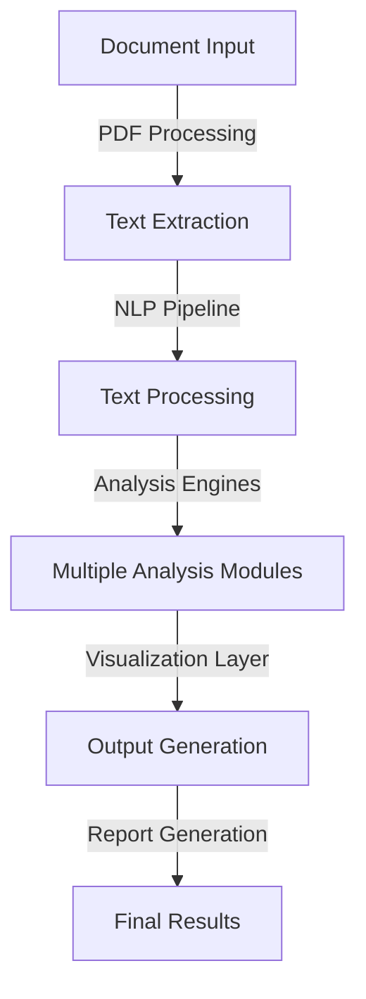
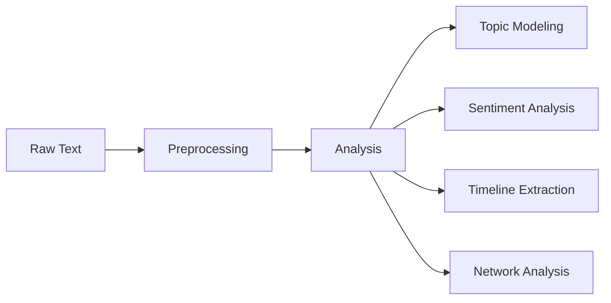

# Religious and Humanities Text Analysis System (RHTAS) 📚


## Table of Contents 📑
- [Overview](#overview)
- [Key Features](#key-features)
- [Technical Architecture](#technical-architecture)
- [Installation](#installation)
- [Usage Guide](#usage-guide)
- [Understanding the Analysis](#understanding-the-analysis)
- [Visualization Guide](#visualization-guide)
- [Troubleshooting](#troubleshooting)
- [Contributing](#contributing)
- [Resources & References](#resources--references)
- [About the Author](#about-the-author)

## Overview 🎯
RHTAS is an advanced text analysis system specifically designed for analyzing religious and humanities texts using artificial intelligence and natural language processing techniques. The project aims to bridge the gap between traditional textual analysis and modern computational methods.

### Why This Project? 🤔
- Religious and humanities texts often contain complex, layered meanings
- Traditional analysis methods can miss subtle patterns and connections
- Need for quantitative insights in qualitative research
- Desire to leverage modern AI/ML techniques in humanities research

### Current Implementation
The system is currently being used to analyze Chapter 4 of Kwame Anthony Appiah's work on race, identity, and the historical narrative of Anton Wilhelm Amo, an 18th-century African philosopher in Germany.

## Key Features 🌟

### 1. Text Processing
- **PDF Parsing**: Advanced structural preservation
- **Preprocessing**: Cleaning, normalization, and tokenization
- **Entity Recognition**: Identification of key persons, places, and concepts

### 2. Analysis Capabilities
- **Topic Modeling**: Latent Dirichlet Allocation (LDA)
- **Sentiment Analysis**: Multi-dimensional emotional content analysis
- **Timeline Extraction**: Chronological event identification
- **Concept Networking**: Relationship mapping between ideas
- **Keyword Analysis**: Frequency and distribution studies

### 3. Visualization Tools
- **Interactive Networks**: Concept relationship visualization
- **Statistical Plots**: Distribution and frequency analysis
- **Word Clouds**: Topic and theme visualization
- **Timeline Plots**: Chronological data representation

## Technical Architecture 🏗️

### System Components


### Analysis Pipeline


## Installation 💻

### System Requirements
- **OS**: Windows 10/11, macOS 10.15+, or Linux
- **Python**: 3.8 or higher
- **RAM**: 16GB minimum (32GB recommended)
- **Storage**: 10GB free space
- **GPU**: NVIDIA GPU with CUDA support (optional but recommended)
- **IDE**: Visual Studio Code ([download](https://code.visualstudio.com/))

### Step-by-Step Installation

1. **Clone the Repository**
```bash
git clone https://github.com/YourUsername/RHTAS.git
cd RHTAS
```

2. **Create Virtual Environment**
```bash
# Windows
python -m venv venv
.\venv\Scripts\activate

# macOS/Linux
python3 -m venv venv
source venv/bin/activate
```

3. **Install Dependencies**
```bash
pip install -r requirements.txt
```

### Required Dependencies
```python
# requirements.txt
spacy==3.5.0
nltk==3.8.1
torch==1.10.0
transformers==4.15.0
networkx==2.6.3
matplotlib==3.5.1
seaborn==0.11.2
PyMuPDF==1.19.0
scikit-learn==1.0.2
community==1.0.0b1
```

4. **Download Required Models**
```python
# Download NLTK data
import nltk
nltk.download(['punkt', 'stopwords', 'averaged_perceptron_tagger', 'vader_lexicon'])

# Download spaCy model
python -m spacy download en_core_web_md
```

## Usage Guide 📖

### Basic Usage
```python
from rhtas import TextAnalyzer

# Initialize analyzer
analyzer = TextAnalyzer(output_path="output/")

# Process single document
analyzer.process_document("path/to/document.pdf")

# Get analysis results
results = analyzer.get_results()
```

### Advanced Usage
```python
# Customize analysis parameters
analyzer = TextAnalyzer(
    output_path="output/",
    num_topics=5,
    min_topic_size=10,
    sentiment_threshold=0.3,
    network_min_edge_weight=0.5
)

# Run specific analyses
analyzer.run_topic_modeling()
analyzer.run_sentiment_analysis()
analyzer.generate_concept_network()
```

## Understanding the Analysis 🔍

### Topic Modeling
- Uses [Latent Dirichlet Allocation (LDA)](https://en.wikipedia.org/wiki/Latent_Dirichlet_allocation)
- Identifies main themes and their related terms
- Visualization through word clouds and distribution plots

### Sentiment Analysis
- Implements [VADER](https://github.com/cjhutto/vaderSentiment) sentiment analysis
- Measures emotional content across different themes
- Provides compound scores for overall sentiment

### Network Analysis
- Uses [NetworkX](https://networkx.org/) for relationship mapping
- Implements community detection algorithms
- Visualizes concept relationships and strengths

### Timeline Extraction
- Identifies temporal references and events
- Creates chronological ordering of events
- Visualizes historical progression

## Visualization Guide 📊

### 1. Concept Network

- Node size indicates concept importance
- Edge thickness shows relationship strength
- Colors represent different communities/themes

### 2. Topic Clusters

- Word clouds for each identified topic
- Size indicates term frequency
- Color indicates term importance

### 3. Sentiment Analysis

- Bar charts showing sentiment scores
- Different themes represented
- Compound score analysis

### 4. Timeline Visualization

- Chronological event plotting
- Event description integration
- Time period analysis  

### 4. Keyword Frequencies

- race: 59
- people: 55
- racial: 52
- amo: 46
- black: 39
- african: 38
- century: 38
- color: 28
  
## Troubleshooting 🔧

### Common Issues and Solutions

1. **Installation Problems**
```bash
# If you encounter CUDA errors
pip install torch==1.10.0+cu113 -f https://download.pytorch.org/whl/cu113/torch_stable.html

# If spaCy model download fails
python -m spacy download en_core_web_md --direct
```

2. **Memory Issues**
- Reduce batch size in config
- Process larger documents in chunks
- Use CPU-only mode if GPU memory is limited

3. **Visualization Errors**
- Check matplotlib backend configuration
- Ensure all required fonts are installed
- Verify output directory permissions

## Contributing 🤝

### How to Contribute
1. Fork the repository
2. Create a feature branch
3. Commit your changes
4. Push to the branch
5. Create a Pull Request

### Development Guidelines
- Follow [PEP 8](https://www.python.org/dev/peps/pep-0008/) style guide
- Add unit tests for new features
- Update documentation
- Include example usage

## Resources & References 📚

### Documentation
- [spaCy Documentation](https://spacy.io/api/doc)
- [NLTK Documentation](https://www.nltk.org/)
- [PyTorch Documentation](https://pytorch.org/docs/stable/index.html)
- [Hugging Face Transformers](https://huggingface.co/docs/transformers/index)
- [NetworkX Documentation](https://networkx.org/)

### Research Papers
1. [LDA: Latent Dirichlet Allocation](https://www.jmlr.org/papers/volume3/blei03a/blei03a.pdf)
2. [VADER: A Parsimonious Rule-based Model for Sentiment Analysis](https://ojs.aaai.org/index.php/ICWSM/article/view/14550)
3. [Digital Humanities Approaches to Text Analysis](https://doi.org/10.1093/llc/fqy005)

### Tutorials
- [Introduction to Text Analysis](https://programminghistorian.org/en/lessons/working-with-text-files)
- [Topic Modeling Tutorial](https://www.machinelearningplus.com/nlp/topic-modeling-gensim-python/)
- [Network Analysis Guide](https://networkx.org/documentation/stable/tutorial.html)

### Additional Resources
- [Digital Humanities Quarterly](http://digitalhumanities.org/dhq/)
- [Text Analysis Tools Registry](https://tapor.ca/tools)
- [Humanities Data Analysis](https://www.humanitiesdata.org/)

## About the Author 👨‍💻

### Md Khairul Islam
- **Institution**: Hobart and William Smith Colleges, Geneva, NY
- **Major**: Robotics and Computer Science
- **Research Interests**: AI, NLP, Digital Humanities
- **Contact**: khairul.islam@hws.edu 
- **LinkedIn**: https://www.linkedin.com/in/khairul7/
- **GitHub**:https://github.com/khairul-me

### Project Maintenance
- Current Version: 1.0.0
- Last Updated: November 15, 2024

---


## Acknowledgments 🙏
- HWS Computer Science Department
- HWS Religion & Humanities Community
- Open Source Contributors

---

*For more information or support, please open an issue or contact the author directly.*
