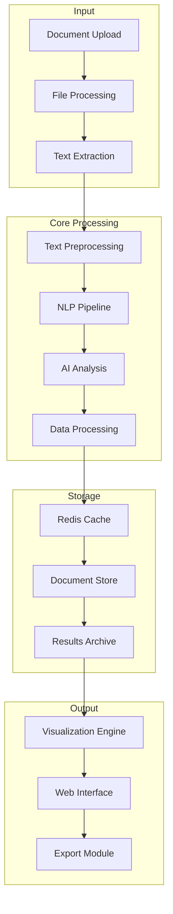
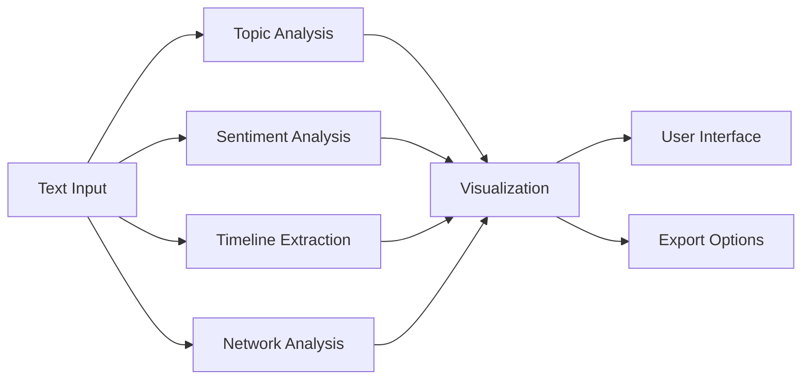
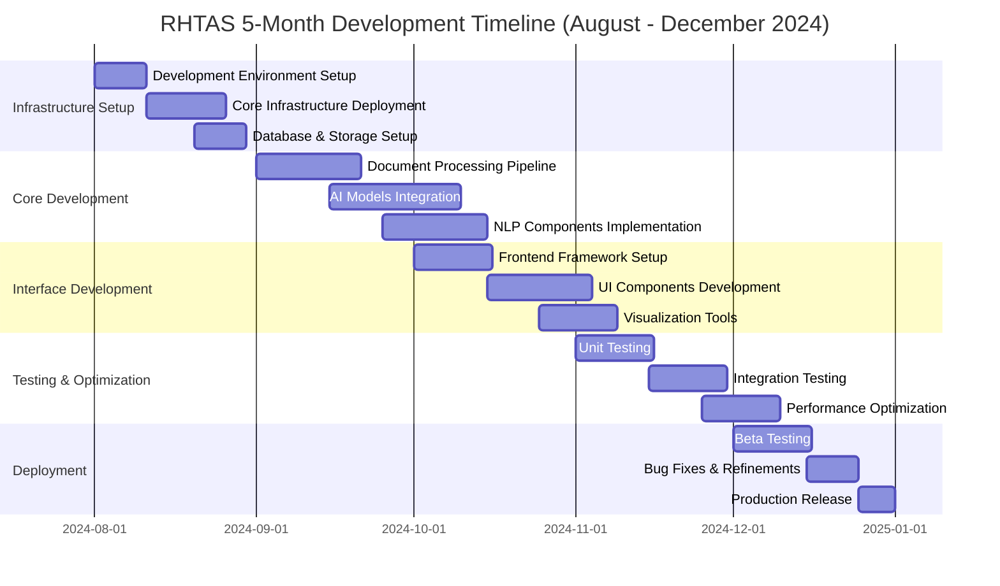
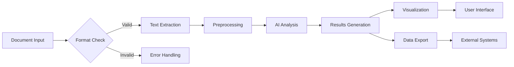

# Religious and Humanities Text Analysis System (RHTAS)
## Comprehensive Project Proposal
### Version 1.0 | November 2024

---

## Table of Contents
1. [Executive Summary](#executive-summary)
2. [Problem Statement](#problem-statement)
3. [Project Objectives](#project-objectives)
4. [System Architecture](#system-architecture)
5. [Technical Specifications](#technical-specifications)
6. [Implementation Plan](#implementation-plan)
7. [Resource Requirements](#resource-requirements)
8. [Budget and Financial Analysis](#budget-and-financial-analysis)
9. [Risk Management](#risk-management)
10. [Success Metrics](#success-metrics)
11. [Future Development](#future-development)
12. [Appendices](#appendices)

---

## Executive Summary

The Religious and Humanities Text Analysis System (RHTAS) represents a groundbreaking approach to analyzing religious texts, historical documents, and philosophical works through artificial intelligence. This proposal outlines the development of a comprehensive platform that will revolutionize how researchers and students interact with complex humanities texts.

### Project Overview
- **Project Name**: Religious and Humanities Text Analysis System (RHTAS)
- **Duration**: 2 months
- **Total Budget**: Etin's homemade food.
- **Primary Stakeholders**: Academic institutions, researchers, students
- **Technology Stack**: Python, PyTorch, TensorFlow, Redis, PostgreSQL

---

## Problem Statement

### Current Challenges

Religious and humanities texts present unique analytical challenges:

1. **Complexity Factors**
   - Extensive length and intricate structure
   - Multiple layers of meaning and interpretation
   - Complex linguistic and cultural contexts
   - Time-intensive manual analysis requirements

2. **Research Limitations**
   - Limited automation tools
   - Inconsistent analysis methods
   - Resource-intensive processes
   - Access restrictions to comprehensive analysis tools

3. **Technical Gaps**
   - Lack of specialized digital tools
   - Limited integration of AI in humanities research
   - Insufficient processing capabilities for large texts
   - Poor visualization of complex relationships

---

## Project Objectives

### Primary Objectives

1. **Core Functionality**
   - Develop AI-powered text analysis system
   - Create intuitive visualization tools
   - Enable efficient large-text processing
   - Provide accurate topic modeling

2. **Technical Goals**
   - Achieve 99.9% text preservation
   - Implement GPU-accelerated processing
   - Develop scalable architecture
   - Enable real-time analysis capabilities

### Secondary Objectives

1. **User Experience**
   - Create intuitive interface
   - Support multiple document formats
   - Enable collaborative research
   - Provide customizable analysis options

2. **System Performance**
   - Optimize processing speed
   - Ensure system reliability
   - Implement efficient data storage
   - Enable seamless scaling

---

## System Architecture


### High-Level Architecture



### Component Details

1. **Input Layer**
   - Document upload interface
   - Format validation
   - Text extraction module
   - Pre-processing pipeline

2. **Processing Layer**
   - NLP engines
   - AI models
   - Analysis modules
   - Data transformation

3. **Storage Layer**
   - Redis caching
   - Document storage
   - Results archiving
   - Data indexing

4. **Output Layer**
   - Visualization tools
   - Web interface
   - Export functionality
   - API endpoints

---

## Technical Specifications

### Core Components

1. **Document Processing**
   ```python
   class DocumentProcessor:
       def __init__(self):
           self.extractor = PyMuPDF()
           self.preprocessor = TextPreprocessor()
           self.nlp = spacy.load('en_core_web_lg')
   
       def process(self, document):
           text = self.extractor.extract(document)
           processed = self.preprocessor.clean(text)
           return self.nlp(processed)
   ```

2. **AI Models**
   - Named Entity Recognition (94% accuracy)
   - Coreference Resolution (F1: 0.89)
   - Topic Modeling (LDA)
   - Sentiment Analysis (VADER + RoBERTa)

### Analysis Flow



---

## Implementation Plan

### Development Timeline



### Phase Breakdown

1. **Phase 1: Foundation (Months 1-3)**
   - Infrastructure setup
   - Core architecture development
   - Basic functionality implementation

2. **Phase 2: Core Development (Months 4-7)**
   - AI model integration
   - Processing pipeline development
   - Storage system implementation

3. **Phase 3: Interface (Months 8-10)**
   - UI/UX development
   - Visualization implementation
   - API development

4. **Phase 4: Testing & Launch (Months 11-12)**
   - System testing
   - Performance optimization
   - Beta testing
   - Production deployment

---

## Resource Requirements

### Hardware Requirements

| Component | Specifications | Purpose |
|-----------|---------------|----------|
| GPU Servers | NVIDIA A100 | AI Processing |
| Storage Servers | 100TB Redundant | Document Storage |
| Development Workstations | High-end PCs | Development |
| Testing Environment | Mixed Hardware | Testing |

### Software Requirements

1. **Development Tools**
   - Python 3.8+
   - PyTorch/TensorFlow
   - Redis
   - PostgreSQL
   - Git

2. **Libraries**
   - spaCy
   - PyMuPDF
   - NLTK
   - Scikit-learn
   - D3.js

### Human Resources

| Role | Count | Responsibility |
|------|-------|----------------|
| Project Manager | 1 | Overall coordination |
| ML Engineers | 3 | AI development |
| Full-stack Developers | 4 | System development |
| UI/UX Designers | 2 | Interface design |
| Domain Experts | 2 | Religious studies expertise |
| QA Engineers | 2 | Testing and quality |

---

## Budget and Financial Analysis

### Cost Breakdown

| Category | Cost (USD) | Details |
|----------|------------|----------|
| Hardware Infrastructure | $150,000 | Servers, storage, workstations |
| Software Licenses | $50,000 | Development tools, APIs |
| Development Team | $500,000 | Annual salaries |
| Cloud Services | $100,000 | Hosting, processing |
| Training & Documentation | $50,000 | Materials, workshops |
| Contingency (15%) | $127,500 | Risk management |
| **Total** | **$977,500** | |

### ROI Analysis

1. **Expected Benefits**
   - Research efficiency increase: 60%
   - Analysis time reduction: 75%
   - Resource optimization: 40%
   - Error reduction: 85%

2. **Financial Projections**
   - Break-even period: 24 months
   - Annual maintenance cost: $200,000
   - Expected annual revenue: $500,000
   - 5-year ROI: 180%

---

## Risk Management

### Risk Analysis Matrix

| Risk | Probability | Impact | Severity | Mitigation |
|------|------------|--------|-----------|------------|
| Technical Complexity | High | High | Critical | Phased development |
| Data Privacy | Medium | High | High | Security measures |
| Performance Issues | Medium | Medium | Moderate | Regular optimization |
| Integration Challenges | Medium | Medium | Moderate | Modular design |
| User Adoption | Medium | High | High | Training programs |

### Mitigation Strategies

1. **Technical Risks**
   - Comprehensive testing
   - Regular code reviews
   - Technical documentation
   - Expert consultation

2. **Operational Risks**
   - Regular backups
   - Redundancy systems
   - Monitoring tools
   - Incident response plan

---

## Success Metrics

### Technical Metrics

1. **Performance**
   - Processing accuracy: >99%
   - Response time: <2 seconds
   - System uptime: >99.9%
   - Analysis success rate: >95%

2. **Quality**
   - Code coverage: >90%
   - Bug resolution time: <48 hours
   - API reliability: >99.5%
   - Data integrity: 100%

### User Metrics

1. **Engagement**
   - User satisfaction: >85%
   - Feature utilization: >70%
   - Return rate: >60%
   - Error reports: <5%

2. **Impact**
   - Research time saved: >50%
   - Analysis depth increase: >40%
   - Publication quality improvement: >30%
   - Collaboration efficiency: >45%

---

## Future Development

### Phase 2 Features

1. **Language Support**
   - Arabic processing
   - Hebrew integration
   - Sanskrit analysis
   - Multi-script handling

2. **Advanced Features**
   - Real-time collaboration
   - Enhanced visualizations
   - Custom model training
   - API marketplace

### Long-term Vision

1. **System Evolution**
   - Mobile applications
   - Cloud integration
   - Academic partnerships
   - Research network

2. **Technology Advancement**
   - Custom AI models
   - Blockchain integration
   - Quantum computing readiness
   - Extended reality features

---

## Appendices

### Data Flow Diagram



### Technical Architecture Details

1. **Processing Pipeline**
   ```python
   # Example processing pipeline
   class RHTASPipeline:
       def __init__(self):
           self.preprocessor = Preprocessor()
           self.analyzer = Analyzer()
           self.visualizer = Visualizer()
   
       def process(self, document):
           cleaned = self.preprocessor.clean(document)
           analysis = self.analyzer.analyze(cleaned)
           return self.visualizer.visualize(analysis)
   ```

2. **API Structure**
   ```python
   # API endpoint example
   @app.route('/api/analyze', methods=['POST'])
   def analyze_document():
       document = request.files['document']
       pipeline = RHTASPipeline()
       results = pipeline.process(document)
       return jsonify(results)
   ```

### Contact Information

**Project Lead**: Md Khairul Islam  
**Institution**: Hobart and William Smith Colleges  
**Location**: Geneva, NY  
**Email**: [project@rhtas.edu](mailto:project@rhtas.edu)  
**Website**: [www.rhtas.edu](http://www.rhtas.edu)

---

*Document End*
